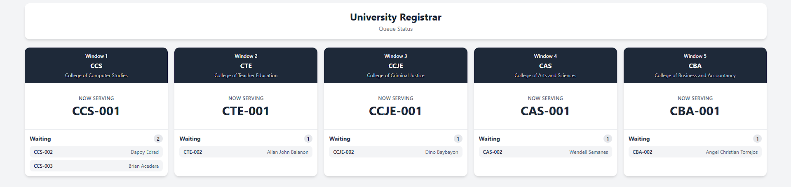

# University Registrar Queueing System

  

  A department-based University Registrar Queueing System built with React, Tailwind CSS, Node.js, and Express.

  
  
  
  
  
  
  

---

## About the Project

The University Registrar Queueing System is a web-based queue management application designed to organize student transactions across different registrar departments.

The system demonstrates frontend development, REST API development, API consumption, department-based queue management, employee access control, real-time queue status updates, and dynamic user interfaces using React.

---

## Features

### Student Queue Registration
- Register for a department queue
- Enter student information
- Select transaction purpose
- Receive a unique department-based queue number
- View queue status and position

### Employee Dashboard
- Dedicated dashboard for each registrar department
- View students waiting in the department queue
- Call the next student
- View the currently serving student
- Complete student transactions
- Automatically refresh queue information

### Public Queue Display
- Display all five registrar windows
- Show currently serving queue numbers
- Show students waiting in each department
- Display the number of students waiting per department
- Automatically update queue information

### Employee Login
- Separate employee login
- Department-based access
- Protected employee dashboard routes
- Demo employee accounts

---

## Registrar Windows

| Window | Department | Queue Code |
|--------|------------|------------|
| Window 1 | College of Computer Studies | CCS |
| Window 2 | College of Teacher Education | CTE |
| Window 3 | College of Criminal Justice | CCJE |
| Window 4 | College of Arts and Sciences | CAS |
| Window 5 | College of Business and Accountancy | CBA |

---

## Queue Status

| Status | Description |
|--------|-------------|
| WAITING | Student is waiting in the department queue |
| SERVING | Student is currently being served |
| COMPLETED | Student's transaction has been completed |

---

## Technologies Used

### Frontend
- React
- React Router
- Tailwind CSS
- Vite
- JavaScript

### Backend
- Node.js
- Express.js
- REST API
- JSON

### Deployment
- Vercel
- Render

### Development
- Visual Studio Code
- Git
- GitHub

---

## System Highlights

### Department-Based Queueing

Each registrar department maintains its own independent queue. Queue numbers are generated based on the department code.

Examples:

- CCS-001
- CTE-001
- CCJE-001
- CAS-001
- CBA-001

### REST API Integration

The React frontend communicates with the Express backend through REST API endpoints for:

- Registering students
- Retrieving queue information
- Calling the next student
- Completing transactions
- Checking individual queue status

### Real-Time Queue Updates

The employee dashboards, student queue status pages, and public display automatically refresh queue information to reflect changes in the system.

### Employee Access Control

Employees can only access the dashboard assigned to their department. Attempting to access another department's dashboard redirects the user back to the login page.

### Queue Position Tracking

Students can view:

- Currently serving queue number
- Number of people ahead
- Current position in the queue
- Current transaction status

### Demo Employee Accounts

| Department | Username | Password |
|------------|----------|----------|
| CCS | ccs | 1234 |
| CTE | cte | 1234 |
| CCJE | ccje | 1234 |
| CAS | cas | 1234 |
| CBA | cba | 1234 |

---

## Live Demo

### Main Application

[University Registrar Queueing System](https://queueing-system-7e42-kohl.vercel.app/)

### Public Queue Display

[Public Queue Display](https://queueing-system-7e42-kohl.vercel.app/display)
